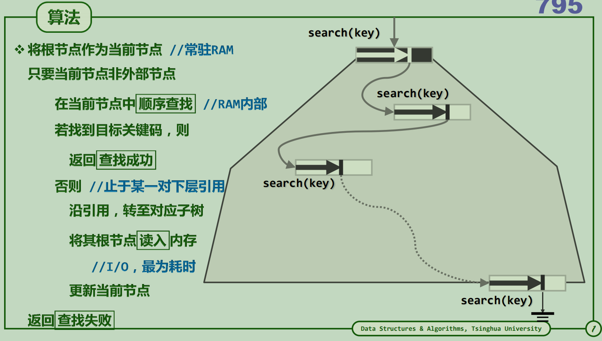
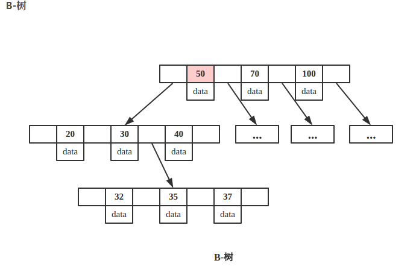
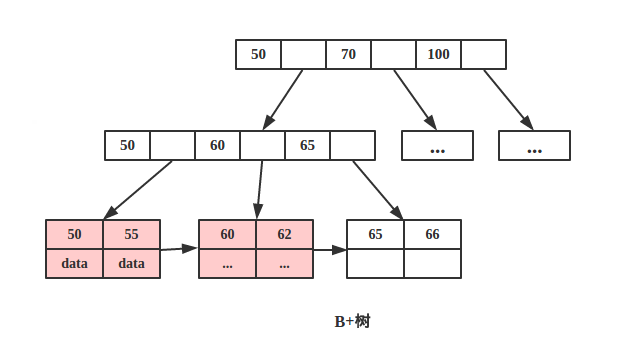

##  线性结构

##  树形结构
+   B-树和B+树
    *   B-树

        平衡的多路搜索树,假设为m路.对于树形结构来讲,一次查询关键码key的时间复杂度取决于树高h.
        
        假设在1G的数据查询关键码key
        
            当m=2时 h=log(2, 10^9) 需要30次I/O(m=2此时退化为AVL树)

            当m=256时 h=log(256, 10^9) 需要4次I/O

        m个节点组成一个有序的大节点

    *   B-树中关键码key的查找过程

        

    *   [B树的实现](https://github.com/96189/xteam/blob/master/%E7%AE%97%E6%B3%95/cpp/MYSTL/BTree.h)

    *   B-树与B+树对比

        B-树

        键值分布在整棵树中,因此,一次查询最好的情况下可以达到O(1)时间复杂度.

        

        B+树
        
        完整的键值只在叶子节点中,非叶子节点中只存储键.因此,一次查询时间复杂度始终固定为O(log(m, n))

        叶子节点组织为有序链表的形式,具备区间访问性,可使用范围查询.

        更适合外部存储,由于内部节点只存储键,则每次磁盘I/O可索引的范围更广.

        

    *   为什么mysql索引选择B+树而不是B-树

        关系型数据库中区间访问(范围查询)是常见的,B+树具体此特性.此外B+树更适合外部存储.

##  图结构

## 相关文章
+   [MySQL索引背后的数据结构及算法原理](http://blog.codinglabs.org/articles/theory-of-mysql-index.html)
+   [从 MongoDB 及 Mysql 谈B/B+树](https://blog.csdn.net/wwh578867817/article/details/50493940)